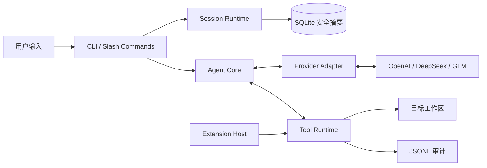

# TriCoder CLI

[](https://github.com/PooooLish/Tricoder-Agent/actions/workflows/ci.yml)
[](https://www.python.org/)

TriCoder CLI 是一个强调可控执行、会话记忆和多模型适配的本地 Coding Agent MVP。它统一接入 OpenAI、DeepSeek 与 GLM 的原生 structured tool calling，并在文件写入和命令执行前要求人工审批。

## 核心亮点

- **统一 Provider 边界**：OpenAI、DeepSeek、GLM 的 OpenAI-compatible SSE 流统一归一化为类型化文本、工具、usage 与完成事件；同步 `complete()` 仍保持兼容。
- **原生工具调用**：默认使用厂商 structured tool calling，并保留显式 `legacy_json` 回滚协议。
- **可控本地执行**：读取、检索（`search_text` 支持正则、基础 `.gitignore` 常用语义（尾随 `/` 目录规则按任意层级匹配）与二进制/超大文件跳过，正则长度与单行长度受限以防灾难性回溯；`glob_files` 按相对模式定位文件，pattern 长度、`**` 数量与扫描结果规模均受限）、编辑、创建文件和运行受限命令；`git_diff` 只读展示工作区未提交变更统计；Provider 原生 `apply_patch` 可在一次审批中应用受限的多文件 unified diff，只允许修改或创建文件，不支持删除或重命名；`--read-only` 禁止 `edit_file`、`create_file`、`apply_patch` 等写入；写操作与命令执行需要人工审批。
- **独立 Session 记忆**：每个 Session 保存独立工作区、Provider、模型、安全摘要和结构化状态。
- **本地斜杠命令**：`/session`、`/model`、`/status`、`/clear` 等命令不会发送给 Provider。
- **可审计与可验证**：运行过程写入 JSONL 审计记录，并由跨平台自动化测试覆盖核心边界。
- **异步与可取消**：异步 Agent 是规范执行路径；取消信号可停止 Provider 读取、重试退避、后续工具和运行中的受管命令，且不会执行尚未完整生成的工具调用。
- **token-aware 上下文**：优先使用 Provider 的真实 usage 作为前缀锚点，缺失时按 UTF-8 字节保守估算；压缩始终以完整任务块和工具回合为单位。
- **大型结果安全暂存**：超过内联上限的工具输出写入 Session 隔离的 TriCoder 运行目录，模型只接收有界预览和不含本机路径的引用。
- **统一 Extension Host**：扩展以安全 descriptor 和显式工具来源接入；生命周期失败隔离、名称冲突双方拒绝、内置工具优先，真实扩展默认关闭。

## Provider 用量与 KV Cache 指标

每次 Provider 响应完成后，只有当服务商 `usage` 至少包含一个有效用量字段时，CLI 才显示该轮的输入、缓存和输出 token 用量行；同一任务的累计用量由各轮已返回的指标相加得到。TriCoder 只归一化并展示/审计这些服务商返回的用量数据，不会在本地保存或管理 KV Cache。

Context Manager 会把同时存在的 `input_tokens` 与 `output_tokens` 绑定到该次请求的精确消息前缀；下一次请求只估算锚点后的新增消息。缺少 `input_tokens`、锚点不再匹配或尚未收到 usage 时，不会把未知值当作零，而是回退到 UTF-8 字节估算。压缩视图中的系统说明不会写入 Session 原始消息，因此固定 prompt 前缀和现有会话持久化边界保持不变。

缓存相关字段是观测值，不是本地缓存状态：单个用量字段缺失或无效时，界面会显示 `-`，不会将未知值当作 `0`；整个 `usage` 缺失、无效或所有字段均无效时，本轮不显示用量行。缓存命中率仅在服务商同时返回可计算的输入和缓存 token 时显示。

本版本没有启用显式 cache key，也没有实现延长缓存保留期等缓存策略；实际缓存行为、命中与保留规则均由所选 Provider 决定。

## 5 分钟快速体验

需要 Python 3.11+。以下为 Windows PowerShell 主路径：

```powershell
python -m venv .venv
.\.venv\Scripts\Activate.ps1
python -m pip install -e .
Copy-Item .env.example .env.local
python -m tricoder doctor --provider deepseek --workspace . --no-color
python -m tricoder chat --provider deepseek --workspace .
```

`.env.local` 只在本机填写；Bash 使用 `source .venv/bin/activate` 和 `cp .env.example .env.local`。`doctor` 不发送模型请求；也可直接运行 `tricoder` 进入默认交互模式。

## 架构与职责



斜杠命令只在本地处理，不会发送给 Provider；普通任务才进入 Agent、Provider 与工具运行时组成的循环。

## 配置与密钥安全

将 `.env.example` 复制为仅供本机使用的 `.env.local`，再在自己的编辑器中填写所选服务商的 API Key。不要将真实 Key 写入 `.tricoder.toml`、`.env.example`、日志、SQLite 数据库或 Git；也不要把 `.env.local` 提交到版本库。可以用 `--env-file` 显式指定密钥文件；进程环境变量的优先级更高。

配置优先级为：命令行参数、进程环境变量、本地密钥文件、项目 `.tricoder.toml`、内置默认值。Provider 的默认 Key 变量和模型如下：

| Provider | API Key 环境变量 | 默认模型 |
| --- | --- | --- |
| OpenAI | `OPENAI_API_KEY` | `gpt-5` |
| DeepSeek | `DEEPSEEK_API_KEY` | `deepseek-v4-flash` |
| GLM | `ZAI_API_KEY` | `glm-5.2` |

## 原生工具协议

三家 Provider 都支持原生 structured tool calling。TriCoder 默认使用 `native`：向 Chat Completions 请求发送工具定义，由 Provider 适配器把厂商响应归一化为 `ProviderResponse`，Agent 一轮内可接受多个结构化工具调用并按顺序逐个执行（每个动作独立审批与审计），用对应的 `tool_call_id` 回填工具结果。

| Provider | 原生工具调用 | 当前适配说明 |
| --- | --- | --- |
| OpenAI | 支持 | 发送工具定义和自动工具选择；客户端关闭并行调用 |
| DeepSeek | 支持 | 发送工具定义和自动工具选择 |
| GLM | 支持 | 发送工具定义和自动工具选择 |

`TRICODER_TOOL_PROTOCOL` 只接受 `native` 或 `legacy_json`，默认是 `native`。环境变量和 `.env.local` 都优先于项目 `.tricoder.toml`，其中进程环境变量优先级最高。`.env.example` 中的协议行默认已注释，因此复制模板后，下面的 TOML 回滚可以直接生效：

```toml
[agent]
tool_protocol = "legacy_json"
```

也可以用临时进程环境变量显式回滚：

```powershell
$env:TRICODER_TOOL_PROTOCOL = "legacy_json"
python -m tricoder doctor --provider openai --workspace . --no-color
```

`doctor` 会显示当前工具协议，但只显示 Key 的变量名和掩码，不显示 Key 内容。排查问题时不要把 Key 粘贴到命令参数、日志、Issue 或聊天记录中。确认 Provider 的原生协议兼容后，把配置改回 `native`。如果曾主动设置进程覆盖，可运行 `Remove-Item Env:TRICODER_TOOL_PROTOCOL`；如果在 `.env.local` 取消注释并设置了该变量，则还必须删除该行、重新注释或改值，否则它仍会覆盖项目 TOML。

可选的项目配置示例：

```toml
[agent]
model = "glm-5.2"
max_rounds = 10
max_context_chars = 80000
timeout = 30
tool_protocol = "native"
plan = true

[providers.glm]
base_url = "https://open.bigmodel.cn/api/coding/paas/v4"

[extensions]
enabled = false

[mcp]
enabled = false

[skills]
enabled = false
project_dir = ".tricoder/skills"

[hooks]
enabled = false

[worktree]
enabled = false

[agents]
enabled = false
max_depth = 1
max_concurrency = 1
default_read_only = true
```

## MCP：默认关闭的本地 stdio 扩展

MCP 只支持在项目配置中明确启用的本地 `stdio` server；不支持远程 MCP、自动
下载或安装 server。MCP server 是本地代码执行，不是 OS 沙盒：获批后，它以当前
TriCoder 进程用户的权限运行。下列配置可直接保存在本仓库的 `.tricoder.toml`；
默认仍是关闭状态，且不会启动任何 server：

```toml
[extensions]
enabled = false

[mcp]
enabled = false
```

本地开发时，可用仓库内不访问网络、环境变量或用户文件的测试 fixture 验证
stdio 接线。先激活项目的 Python 环境，再将下例改为显式启用；它不会安装任何
软件，也不应改用公共 server 命令：

```toml
[extensions]
enabled = true

[mcp]
enabled = true

[[mcp.servers]]
id = "local_test"
transport = "stdio"
command = "python"
args = ["tests/fixtures/fake_mcp_server.py"]
enabled = true
credential_env = []
```

每个 Coding Task 都会重新启动每台已启用 server，并再次请求启动审批；不会跨
任务或 Session 复用连接。每个 MCP 工具固定为 `dangerous`，即使权限为
`fullaccess` 也必须逐次获得人工审批。`--read-only` 会在审批前拒绝它们。

生产本地 stdio 使用 TriCoder 自持的 transport：直接持有 server 进程句柄，并分别
记录进程退出和自持资源关闭证据。成功停止证明**直接 server 进程已退出**，且
TriCoder 自持的流与任务已关闭；不证明所有脱离进程组或后台化的后代都已消失。
原始 SDK 日志只在任务局部、精确匹配 logger 名称和 SDK 源文件路径的适配器作用域
内过滤，不按消息正文识别或脱敏，也不静音其他来源的同名日志。

该适配器绑定 `mcp==2.1.1`；升级必须重新审查能力接口、日志来源、生命周期和
依赖安全。本地 Windows 离线测试及仓库 fake server 不是跨平台证明，真实外部
MCP server 与真实 Provider 兼容性仍未验证；远程 MCP、自动安装和 OS 沙盒均不支持。

如 server 确实需要凭据，`.tricoder.toml` 中的 `credential_env` 只能写环境变量
**名称**。名称还必须由启动 TriCoder 的可信进程环境中的
`TRICODER_EXTENSION_ENV_ALLOWLIST` 明确授权；凭据值永远不得写入 TOML、示例、
日志或审计。配置或 server 给出的不受支持 JSON Schema 会被显式拒绝，绝不会在
缺少验证时执行。

## Extension Host 与配置信任

所有扩展家族默认关闭；项目配置中的未知安全字段、非布尔开关、非法/重复 ID、
非 `stdio` transport、越界 Skill 路径、负预算和明文凭据字段都会直接导致配置
失败，不会回退到更宽松状态。

动态工具必须携带来源 ID 和 `read`、`write`、`process`、`network` 或
`dangerous` 风险声明，并绑定当前 `ToolContext`。注册时会冻结并校验 JSON Schema；
内置工具名不可覆盖，两个扩展声明同名工具时双方都不注册。非只读动态工具继续
经过统一审批；`--read-only` 会在审批前拒绝它们，`dangerous` 即使在
`fullaccess` 下仍要求人工确认。扩展异常只返回固定安全分类，不回显原始异常。

`.tricoder.toml` 只能用 `credential_env` 保存环境变量名。仅写变量名不等于授权：
用户还必须在启动 TriCoder 的可信**进程环境**中设置逗号分隔的
`TRICODER_EXTENSION_ENV_ALLOWLIST`。该 allowlist 从工作区 `.env.local` 读取时
不会生效，防止项目配置自行选择并外传已有凭据。`doctor` 只显示扩展 ID、类型、
有效启用状态、`project` 信任级别和凭据的“无需/未授权/缺失/已设置”状态，不显示
命令参数、凭据值或底层异常。

## 执行前规划（Planner-Executor）

每个任务在进入工具循环前默认有一次**规划阶段**（round 0，不带工具）：Agent 基于任务
与会话摘要先输出 3–8 步执行计划（JSON 或 Markdown 列表），计划作为消息注入后续执行，
让多步任务按计划推进。规划阶段只生成文本、无副作用，不写文件、不执行命令。

- 规划失败（Provider 错误 / 解析失败）时**降级为无计划执行**，不阻塞任务。
- 计划文本不写入 SQLite 或审计原文（审计只记录步骤数与字符数）。
- 关闭规划：`--no-plan` 命令行参数，或环境变量 `TRICODER_PLAN=0`，或项目配置
  `[agent] plan = false`（命令行 > 环境变量 > 项目配置 > 默认开启）。
- 规划增加一次模型调用与 token 成本，可用上述方式关闭。

## 使用方式

`--help` 只显示帮助，不会进入交互模式：

```powershell
python -m tricoder --help
python -m tricoder doctor --help
python -m tricoder run --help
python -m tricoder chat --help
```

一次性运行任务：

```powershell
python -m tricoder run "修复重复提交问题并运行测试" `
  --provider deepseek `
  --workspace D:\path\to\project `
  --max-context-chars 60000
```

只读分析不会编辑文件或执行命令：

```powershell
python -m tricoder run "分析项目结构和潜在风险" `
  --provider openai `
  --workspace D:\path\to\project `
  --read-only
```

进入持续交互会话有两个等价入口：

```powershell
tricoder
tricoder chat --provider deepseek --workspace D:\path\to\project
```

裸 `tricoder` 使用当前目录作为工作区；`tricoder chat` 支持 `run` 的工作区、Provider、模型、密钥文件、审计目录、上下文预算、轮数、超时、只读与颜色选项，但没有任务位置参数。

基于 Textual 的本地 TUI（组件化消息流、模态审批，安全边界与 `chat` 一致）：

```powershell
python -m tricoder tui --provider deepseek --workspace D:\path\to\project
```

`tui` 与 `chat` 接受相同选项；空闲时 `Ctrl+C` 清空输入，任务运行时 `Ctrl+C` 请求取消；活动任务中按 `Ctrl+Q` 会先发出取消并以非零码退出，空闲退出才重试保存记忆。写操作与命令执行仍在模态中明确确认。TUI 中 `/permission`、`/session`、`/model` 不带参数时会弹出方向键选择列表（↑/↓ 选择 · Enter 确认 · Esc 取消）。每轮工具调用折叠为一个可展开块（标题含工具摘要），避免长任务刷屏。

## 交互命令与 Session

斜杠命令始终只在本地处理，不会发送给 Provider：

| 命令 | 行为 |
| --- | --- |
| `/help` | 显示命令、参数和示例。 |
| `/status` | 显示当前 Session、工作区、Provider、模型、只读、验证及上下文状态。 |
| `/model` | 显示 OpenAI、DeepSeek、GLM 的模型并按序号切换。 |
| `/clear` | 仅在输入 `y` 或 `yes` 后清除当前 Session 的运行时上下文和持久化摘要。 |
| `/diff` | 本地展示当前 Session 最近一次非空任务的正向 unified diff，不发送给 Provider。 |
| `/undo` | 先本地展示当前 Session 最近一次非空任务的完整反向 unified diff；仅在输入 `y` 或 `yes` 后尝试撤销整组变更。任何外部内容、权限模式或文件身份冲突都会拒绝全部写入；`--read-only` 会在预览或确认前拒绝撤销。 |
| `/session` | 列出全部 Session，并按序号选择。 |
| `/session new <名称>` | 用当前工作区、Provider 和模型创建并切换到新 Session。 |
| `/session current` | 显示当前 Session 的详细信息。 |
| `/session rename <名称>` | 重命名当前 Session。 |
| `/permission` | 查看当前权限级别（strict / relaxed / fullaccess），级别随会话记忆持久化，重启或切换会话自动恢复。 |
| `/permission relaxed` | 切换为 relaxed：仅不返回文件正文的 Git 元数据查询（受限的 `status`、`diff --stat`、`diff --name-only`）自动放行；`show`、`log`、补丁 diff 及一切能执行代码的命令继续要求人工审批；文件写入仍人工审批。 |
| `/permission fullaccess` | 切换为 fullaccess：放行全部非危险工具（文件写入与命令自动执行）；**这不是进程沙盒**——命令仍受 `CommandPolicy` 白名单、`--read-only`、敏感路径与 git 仓库根边界约束，未来 `delete_file` 等破坏性工具加入危险集合后仍审批。 |
| `/permission strict` | 恢复严格模式：写操作与命令执行均需人工审批。 |
| `/exit` | 保存安全记忆并退出。 |

`/session` 切换到其他工作区时会显示目标绝对路径，必须明确输入 `y` 或 `yes` 才会继续。切换会先构建并验证目标配置、策略、工具和 Agent；任何一步失败都会保留原 Session 和原工作区。

`/clear` 不删除 Session，不会改动目标工作区中的文件，也保留 Provider、模型、工作区、修改文件元数据和审计记录；它会清除当前会话的消息历史、可持久化摘要，以及该 Session 的临时大型工具结果。

## 任务级变更预览与撤销

每次非空 Agent 任务的文件净变更只保存在当前进程中对应 Session 的内存账本里。`/diff` 正向预览最近一条非空任务，在 `--read-only` 下仍可使用；`/undo` 先完整预览反向 diff，再以 `y` 或 `yes` 明确确认。`--read-only` 会在预览或确认前稳定拒绝 `/undo`。撤销会重新核验每个目标的内容、权限模式与文件身份；只要发现任一外部冲突，就拒绝全部写入。经确认后，撤销也可能删除由该任务创建的文件。

源码快照以及本地生成的正向/反向 diff 不会写入 SQLite、JSONL 审计记录或发送给 Provider。`apply_patch` 的补丁文本由 Provider 生成并作为原生工具调用参数进入当前进程的消息上下文；同一任务继续推理时，它可能随后续轮次的消息历史再次发送给 Provider，但不会写入 SQLite 或 JSONL 审计记录。内存账本总预算为 2,000,000 个字符，进程重启后历史即消失。MVP 不提供 `/redo`、多级撤销、按历史记录选择撤销、持久化撤销历史，也不依赖 Git；`apply_patch` 同样不支持文件删除或重命名补丁。

## Session 数据与恢复

SQLite 数据库位于系统状态目录，不会写入目标工作区：

- Windows：`%LOCALAPPDATA%\TriCoder\sessions.db`；若未设置 `LOCALAPPDATA`，使用 `%USERPROFILE%\AppData\Local\TriCoder\sessions.db`。
- 其他系统：`$XDG_STATE_HOME/tricoder/sessions.db`；若未设置 `XDG_STATE_HOME`，使用 `~/.local/state/tricoder/sessions.db`。

每个 Session 独立保存名称、工作区绝对路径、Provider、模型、时间戳、修改文件路径、验证状态和受限长度的安全摘要。进程运行期间，每个已打开 Session 有独立的完整消息上下文；重启后只恢复安全摘要和结构化元数据。Agent 如需源码，必须重新调用读取工具。

会话持久化只保存受控结构化元数据，不保存任何用户任务或模型 `RunResult.summary` 的自由文本原文。无论内容是空白、中英文自然语言、源码、命令、工具输出、Provider 原始响应、动作 JSON、认证信息还是完整消息历史，SQLite 中的 `requirements_summary` 都只保存长度占位；运行结果只保存固定格式的成功/失败、修改文件数量和规范化验证状态。成功编辑或创建的文件路径由工作区策略解析后以规范相对路径保存，不会保存原始绝对路径或 `..` 形式。这个策略不依赖“看起来像代码或命令”的启发式判断。

完整消息上下文仅保留在当前进程的 Session 中，CLI 仍会在当前轮显示 `RunResult.summary`；重启后只能恢复上述结构化元数据和长度占位。该边界仍需配合工作区权限和本地存储权限管理。

大型工具结果不进入 SQLite。默认暂存目录与数据库位于同一状态根下的 `runtime/tool-results/session_<hash>/`，不位于目标源码工作区；文件名与引用均由系统生成。模型可用 `read_tool_result` 按引用和字符偏移分段回读当前 Session 的结果，不能传入文件路径。单项默认最多 2 MB、单 Session 默认最多 10 MB；启动时会清理上次进程遗留内容，`/clear` 只清理当前 Session。JSONL 审计只记录引用、字节数和 SHA-256，不记录正文或绝对路径。

如果数据库无法安全初始化，交互入口会以配置错误退出（退出码 `2`），不会改用其他工作区。运行中持久化失败时，当前内存会话可继续使用，但界面会提示“本次记忆未持久化”；`/exit` 会再尝试保存，仍失败时以非零退出码结束。

## 运行边界

- 文件写入和命令执行都需要在终端明确输入 `y` 或 `yes` 审批；`--read-only` 会禁止这两类操作。
- `/permission relaxed` 与 `/permission fullaccess` 是显式降级：relaxed 仅自动放行受限的 Git 元数据查询，
  fullaccess 自动放行全部非危险工具（**明确不是进程沙盒**）；两者都**不放松**命令白名单、
  `--read-only`、敏感路径与 git 仓库根边界，默认 `strict` 模式下所有操作都审批。
- Agent 只能访问指定工作区内的非敏感文件，越界或敏感路径会被拒绝。
- git 只读命令仅在工作区本身就是仓库根时可用；工作区是仓库子目录时 git 会向上读取
  仓库根的历史与源码，此类执行会被拒绝。
- 允许的命令限于测试、静态检查、只读 Git 查询，以及工作区内相对 `.py` 脚本执行
  （`python <脚本>`；脚本必须解析为工作区内存在的普通 `.py` 文件，无 `..`、无绝对路径、
  无符号链接逃逸；**relaxed 不自动放行任何代码执行命令**，自动执行与否由权限级别控制，
  `fullaccess` 放行，`strict`/`relaxed` 仍需人工审批）。审批不是操作系统或容器沙箱的替代品。
- 子进程环境会剔除名称匹配 `api_key`/`token`/`password`/`secret`/`credential` 等敏感模式的变量，
  防止 Provider API Key 与其它凭据泄漏给被执行的测试、脚本或子进程。
- 发送任务会将相关代码片段交给所选 Provider；只应在获准发送的项目中使用。

## 审计、上下文与退出码

每次 `run` 会写入 JSONL 审计文件。默认目录：Windows 为 `%LOCALAPPDATA%\TriCoder\runs`，其他系统为 `$XDG_STATE_HOME/tricoder/runs`；可用 `--audit-dir` 覆盖。只读模式下，审计目录不能位于目标工作区中。

`--max-context-chars` 仍保留旧版字符硬上限，同时其数值也作为 token 安全上限供 Context Manager 使用。Provider usage 可用时优先按真实 token 锚点判断；不可用时采用保守估算。固定 system 与当前 task、当前任务的完整工具回合不会被拆分，即使它们自身超限；旧历史按完整任务块截断，避免出现孤立 call/result。当前实现不生成语义摘要。

`run` 的退出码：`0` 表示任务满足完成条件，`1` 表示任务未完成或最后验证失败，`2` 表示配置或运行前审计准备失败。

## 新增 Provider 适配器

新增 Provider 时保持边界最小：

1. 在 `src/tricoder/config.py` 注册默认 Key 环境变量、HTTPS Base URL、模型和允许的官方 Base URL。
2. 在 `src/tricoder/providers.py` 声明 `ProviderCapabilities` 并注册工厂。若不是 OpenAI-compatible 协议，实现 `ModelProvider.complete(messages, tools)`。
3. `complete()` 返回归一化的 `ProviderResponse`（其中包含 `ToolCall`）；厂商响应无法解析或不满足协议时抛出 `ProviderProtocolError`。不要把厂商原始响应或认证头传给 Agent、日志或终端。
4. 在 `src/tricoder/cli.py` 的 `--provider` choices，以及 `src/tricoder/ui.py` 的 Provider label、帮助和选择列表等公开注册点加入名称。
5. 为配置、请求序列化、响应解析、协议错误、UI/CLI 脱敏输出与交互选择补测试。

只有在适配器确实验证了原生工具调用时才声明 `native_tool_calling=True`。`legacy_json` 是显式兼容回滚路径，不应成为新 Provider 绕过结构化响应适配的默认实现。

## Eval

`tricoder eval` 用版本控制内的 fixture、隔离工作副本和 Agent 结束后才注入的隐藏
verifier，评测本地 Coding Agent 的确定性完成条件。默认会真实调用 OpenAI Provider；
可显式选择 Provider 或只运行一个 case，以控制费用：

```powershell
python -m tricoder eval evals/smoke --no-color
python -m tricoder eval evals/smoke --provider deepseek --no-color
python -m tricoder eval evals/smoke --provider glm --case fix-subtract --no-color
```

先校验评测定义且不读取 Key、不构建 Provider 或创建运行状态时，使用离线 dry-run：

```powershell
python -m tricoder eval evals/smoke --dry-run --no-color
```

真实运行的隔离工作副本、结构化结果和 Markdown 报告位于
`runtime/evals/<run-id>/`。Eval 使用的 `fullaccess` 仅代表 TriCoder 自动批准策略
允许的工具，**不是操作系统沙盒**；命令白名单、工作区边界和敏感环境变量过滤仍然
生效。内置 smoke suite 的自动测试只验证离线框架与 fixture 合约，不代表已完成三家
真实 Provider 的质量验证；真实运行会使用本机配置并可能产生费用。

## 测试

### 无密钥自动化测试

以下检查不联网，也不需要真实 API Key；GitHub Actions 会在 Windows/Linux 和 Python 3.11/3.12 上执行同样的验证：

```powershell
python -m unittest discover -s tests -v
python -m compileall -q src tests
```

### 本地真实 API 冒烟测试

真实 API 测试只在开发者明确配置 `.env.local` 后本地执行，可能产生费用，也可能受 Provider 网络状态影响，因此不纳入 CI。读取、修改和命令执行练习应在 [`test/`](test/README.md) 手动实验区中进行，不要放入真实密钥、私人数据或重要文件。

```powershell
python -m tricoder run "只读检查 smoke_demo.py，并说明 add 函数的行为" --provider openai --workspace test --read-only
```

将 `--provider` 分别替换为 `deepseek` 和 `glm` 即可验证三家 Provider。涉及创建文件或运行命令的测试会进入人工审批流程，测试目标必须留在 `test/`。

## 路线

以下方向尚未实现或尚未验证：真实外部/用户 MCP server 验证、Skills/项目指令加载、Hooks、Worktree、子 Agent、Session 删除与导出、命令插件/自动补全、可选检索记忆、演示 GIF。本地 stdio MCP 已实现并由仓库内 fake server 覆盖；它不等同于外部 server 的兼容性证明。

## 开源参考

项目仅参考 mini-swe-agent、Aider、OpenCode 和 OpenHands 的公开高层设计思想，未复制或集成其代码。比较与复用边界见 [docs/open-source-assessment.md](docs/open-source-assessment.md)。
