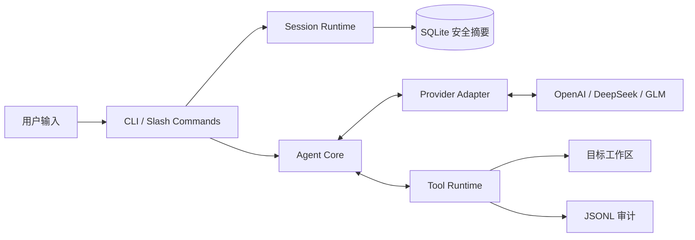

# Tricoder CLI Portfolio CI And README Implementation Plan

> **For agentic workers:** REQUIRED SUB-SKILL: Use superpowers:subagent-driven-development (recommended) or superpowers:executing-plans to implement this plan task-by-task. Steps use checkbox (`- [ ]`) syntax for tracking.

**Goal:** 为 Tricoder CLI 增加无密钥的跨平台持续集成，并把 README 整理成招聘者可快速理解和复现的简历项目入口。

**Architecture:** GitHub Actions 使用一个只读权限的矩阵作业，在 Windows/Linux 和 Python 3.11/3.12 上安装并验证项目。README 作为展示入口，复用现有准确说明，并通过首屏亮点、快速体验、架构图和分层测试说明建立从“项目价值”到“可验证证据”的阅读路径。

**Tech Stack:** GitHub Actions、Python 3.11/3.12、`unittest`、`compileall`、Markdown、Mermaid、Rich CLI。

## Global Constraints

- 不创建 Git 标签、GitHub Release、PyPI 包或自动发布流程。
- CI 只使用 `contents: read`，不读取 `.env.local`，不声明 Provider Secret，也不执行真实 API 请求。
- CI 矩阵固定为 `ubuntu-latest`、`windows-latest` × Python `3.11`、`3.12`。
- CI 固定运行 `python -m unittest discover -s tests -v` 和 `python -m compileall -q src tests`。
- README 不展示真实密钥、本机私有路径或无法由代码和测试验证的性能数字。
- README 明确区分无密钥自动化测试与需要联网、可能产生费用的本地真实 API 冒烟测试。
- 不改动 `src/tricoder/` 业务代码，不新增运行时依赖。

---

## File Map

- Create: `.github/workflows/ci.yml` — 定义无密钥、只读权限的跨平台测试矩阵。
- Modify: `README.md` — 提供项目定位、能力亮点、快速体验、架构、测试证据和后续边界。
- Reference: `test/README.md` — README 链接到已有手动测试沙盒说明，不重复维护步骤。
- Reference: `docs/superpowers/specs/2026-08-01-portfolio-ci-readme-design.md` — 本计划的已批准设计依据。

### Task 1: Cross-platform GitHub Actions CI

**Files:**
- Create: `.github/workflows/ci.yml`
- Test: `tests/`（运行既有完整测试套件，不新增仅验证 YAML 文本的脆弱测试）

**Interfaces:**
- Consumes: `pyproject.toml` 中的 Python `>=3.11` 和 editable install 配置；`tests/` 中的 `unittest` 套件。
- Produces: 名为 `CI` 的 GitHub Actions 工作流，以及可由 README 引用的 `ci.yml` badge endpoint。

- [ ] **Step 1: 建立本地基线**

Run:

```powershell
python -m unittest discover -s tests -v
python -m compileall -q src tests
```

Expected: 单元测试通过；Windows 无符号链接权限时允许现有相关测试显示 `skipped`；`compileall` 退出码为 `0`。

- [ ] **Step 2: 创建最小权限 CI 工作流**

Create `.github/workflows/ci.yml` with exactly this structure:

```yaml
name: CI

on:
  push:
    branches: [main]
  pull_request:
  workflow_dispatch:

permissions:
  contents: read

jobs:
  test:
    name: ${{ matrix.os }} / Python ${{ matrix.python-version }}
    runs-on: ${{ matrix.os }}
    strategy:
      fail-fast: false
      matrix:
        os: [ubuntu-latest, windows-latest]
        python-version: ["3.11", "3.12"]

    steps:
      - name: Check out repository
        uses: actions/checkout@v6

      - name: Set up Python
        uses: actions/setup-python@v6
        with:
          python-version: ${{ matrix.python-version }}

      - name: Install project
        run: python -m pip install -e .

      - name: Run unit tests
        run: python -m unittest discover -s tests -v

      - name: Compile Python sources
        run: python -m compileall -q src tests
```

- [ ] **Step 3: 检查工作流边界**

Run:

```powershell
Select-String -LiteralPath .github\workflows\ci.yml -Pattern 'contents: read','ubuntu-latest','windows-latest','"3.11"','"3.12"','unittest discover','compileall'
Select-String -LiteralPath .github\workflows\ci.yml -Pattern 'secret','env.local','smoke_demo' -CaseSensitive:$false
git diff --check
```

Expected: 第一条命令命中全部必要配置；第二条命令没有输出；`git diff --check` 没有输出且退出码为 `0`。

- [ ] **Step 4: 重跑本地验证**

Run:

```powershell
python -m unittest discover -s tests -v
python -m compileall -q src tests
```

Expected: 结果与 Step 1 的基线一致，没有业务回归。

- [ ] **Step 5: 提交 CI**

```powershell
git add .github/workflows/ci.yml
git commit -m "ci: add cross-platform test matrix"
```

Expected: 只提交 `.github/workflows/ci.yml`。

### Task 2: Portfolio-oriented README

**Files:**
- Modify: `README.md`
- Reference: `test/README.md`

**Interfaces:**
- Consumes: Task 1 产生的 `.github/workflows/ci.yml`；现有 CLI、Provider、Session、审计和测试行为。
- Produces: 指向 `PooooLish/Tricoder-Agent` CI 的徽章，以及可独立阅读的项目展示入口。

- [ ] **Step 1: 重写 README 首屏**

在标题下加入以下徽章和定位，不更改项目正式名称：

```markdown
[](https://github.com/PooooLish/Tricoder-Agent/actions/workflows/ci.yml)
[](https://www.python.org/)

TriCoder CLI 是一个强调可控执行、会话记忆和多模型适配的本地 Coding Agent MVP。它统一接入 OpenAI、DeepSeek 与 GLM 的原生 structured tool calling，并在文件写入和命令执行前要求人工审批。
```

紧接着增加“核心亮点”，使用六个可由代码或测试验证的要点：

```markdown
## 核心亮点

- **统一 Provider 边界**：OpenAI、DeepSeek、GLM 响应统一归一化为内部 `ProviderResponse` 与 `ToolCall`。
- **原生工具调用**：默认使用厂商 structured tool calling，并保留显式 `legacy_json` 回滚协议。
- **可控本地执行**：读取、编辑、创建文件和运行受限命令；写操作与命令执行需要人工审批。
- **独立 Session 记忆**：每个 Session 保存独立工作区、Provider、模型、安全摘要和结构化状态。
- **本地斜杠命令**：`/session`、`/model`、`/status`、`/clear` 等命令不会发送给 Provider。
- **可审计与可验证**：运行过程写入 JSONL 审计记录，并由跨平台自动化测试覆盖核心边界。
```

- [ ] **Step 2: 增加五分钟快速体验**

将现有“安装与帮助”和首次配置内容收敛为首屏后的“5 分钟快速体验”，保留 Windows PowerShell 主路径，并标注 Bash 对应的激活与复制命令：

```powershell
python -m venv .venv
.\.venv\Scripts\Activate.ps1
python -m pip install -e .
Copy-Item .env.example .env.local
python -m tricoder doctor --provider deepseek --workspace . --no-color
python -m tricoder chat --provider deepseek --workspace .
```

在命令块后明确说明：`.env.local` 只在本机填写；Bash 使用 `source .venv/bin/activate` 和 `cp .env.example .env.local`；`doctor` 不发送模型请求；也可直接运行 `tricoder` 进入默认交互模式。

- [ ] **Step 3: 增加架构图和职责说明**

在快速体验之后加入以下 Mermaid 图，并用一段话说明斜杠命令只在本地处理、普通任务才进入 Agent/Provider 工具循环：



- [ ] **Step 4: 整理已有详细说明并补全测试证据**

保留并去重以下现有主题：密钥安全、原生工具协议、使用方式、斜杠命令与 Session、Session 数据恢复、运行边界、审计与退出码、Provider 扩展。

将“测试”章节改成两层：

````markdown
### 无密钥自动化测试

以下检查不联网，也不需要真实 API Key；GitHub Actions 会在 Windows/Linux 和 Python 3.11/3.12 上执行同样的验证：

```powershell
python -m unittest discover -s tests -v
python -m compileall -q src tests
```

### 本地真实 API 冒烟测试

真实 API 测试只在开发者明确配置 `.env.local` 后本地执行，可能产生费用，也可能受 Provider 网络状态影响，因此不纳入 CI。读取、修改和命令执行练习应在 [`test/`](test/README.md) 沙盒中进行，不要放入真实密钥、私人数据或重要文件。

```powershell
python -m tricoder run "只读检查 smoke_demo.py，并说明 add 函数的行为" --provider openai --workspace test --read-only
```

将 `--provider` 分别替换为 `deepseek` 和 `glm` 即可验证三家 Provider。涉及创建文件或运行命令的测试会进入人工审批流程，测试目标必须留在 `test/`。
````

在文末加入具体路线而非承诺：Session 删除与导出、命令插件/自动补全、可选检索记忆、演示 GIF；明确它们是尚未实现的方向。

- [ ] **Step 5: 校验 README 的事实和链接**

Run:

```powershell
Select-String -LiteralPath README.md -Pattern 'actions/workflows/ci.yml','OpenAI','DeepSeek','GLM','structured tool calling','/session','test/README.md','Python 3.11/3.12'
git diff --check
git diff -- README.md
```

Expected: 必要能力与链接全部命中；无空白错误；差异没有真实 Key、本机私有绝对路径、Release/PyPI 发布声明或未经验证的性能数字。

- [ ] **Step 6: 提交 README**

```powershell
git add README.md
git commit -m "docs: improve portfolio project presentation"
```

Expected: 只提交 `README.md`。

### Task 3: Final Verification And Remote CI

**Files:**
- Verify: `.github/workflows/ci.yml`
- Verify: `README.md`
- Verify: all tracked files through Git status and filename-only credential scan

**Interfaces:**
- Consumes: Tasks 1–2 的两个独立提交。
- Produces: 已推送到 `origin/main` 且四个矩阵任务全绿的简历展示版本。

- [ ] **Step 1: 运行完整本地验收**

Run:

```powershell
python -m unittest discover -s tests -v
python -m compileall -q src tests
git diff --check
git status --short --branch
```

Expected: 测试与编译成功；没有未提交差异；`main` 只领先 `origin/main` 本轮的设计、CI 和 README 提交。

- [ ] **Step 2: 执行不回显凭据内容的跟踪文件扫描**

Run:

```powershell
$credentialScanPattern = '(sk-[A-Za-z0-9_-]{20,}|Bearer[[:space:]]+[A-Za-z0-9._-]{20,}|(OPENAI|DEEPSEEK|ZAI)_API_KEY[[:space:]]*=[[:space:]]*[^<[:space:]])'
$allowedCredentialFixtureFiles = @(
  '.env.example',
  'docs/superpowers/plans/2026-07-31-interactive-slash-sessions.md',
  'tests/test_cli.py',
  'tests/test_config.py'
)
$credentialHitFiles = @(git grep -l -E $credentialScanPattern --)
$unexpectedCredentialHitFiles = @($credentialHitFiles | Where-Object { $_ -notin $allowedCredentialFixtureFiles })
if ($unexpectedCredentialHitFiles.Count -gt 0) {
  $unexpectedCredentialHitFiles
  throw 'Unexpected credential-like content found.'
}

$trackedSensitiveFiles = @(git ls-files -- .env .env.local '*.key' '*.pem')
if ($trackedSensitiveFiles.Count -gt 0) {
  $trackedSensitiveFiles
  throw 'Sensitive credential file is tracked.'
}
```

Expected: `unexpectedCredentialHitFiles` 和 `trackedSensitiveFiles` 两类输出均为空。凭据内容扫描仅以文件名形式输出不在允许列表中的异常文件，绝不输出匹配文本。

- [ ] **Step 3: 推送当前 `main`**

```powershell
git push origin main
```

Expected: 推送成功；不推送标签，也不创建 Release。

- [ ] **Step 4: 等待并检查 GitHub Actions**

Run:

```powershell
$latestCiRunId = gh run list --workflow ci.yml --branch main --limit 1 --json databaseId --jq '.[0].databaseId'
if (-not $latestCiRunId) { throw 'No CI run found for main.' }
gh run watch $latestCiRunId --exit-status
```

Expected: `ubuntu-latest`、`windows-latest` × Python 3.11、3.12 四个任务全部成功。

- [ ] **Step 5: 核对远端展示**

Run:

```powershell
gh repo view PooooLish/Tricoder-Agent --json url,defaultBranchRef
gh release list --repo PooooLish/Tricoder-Agent --limit 1
git tag --list
```

Expected: 默认分支为 `main`；没有标签或 Release；在返回的仓库 URL 中人工确认 README 徽章显示通过，首屏包含定位、亮点、快速体验和架构图。
